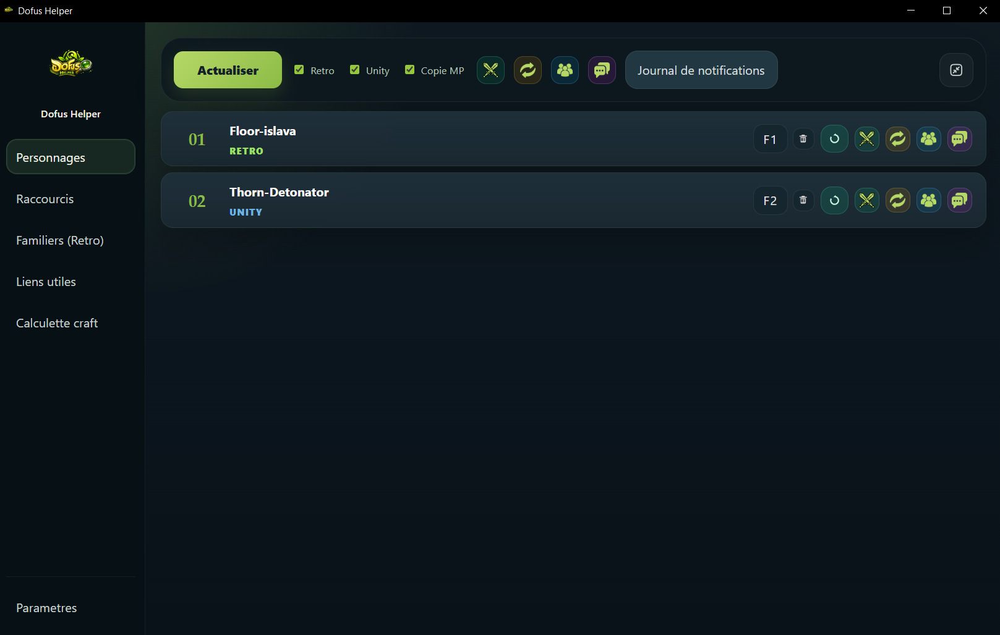
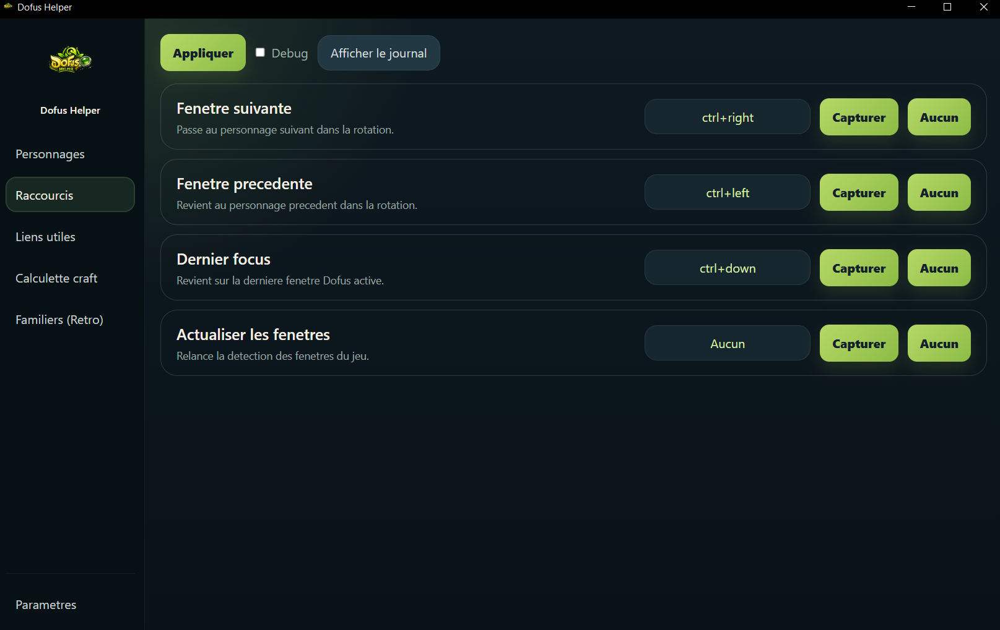
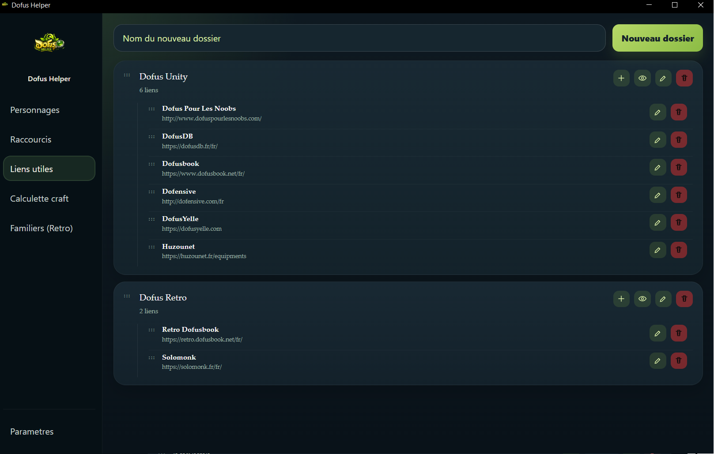
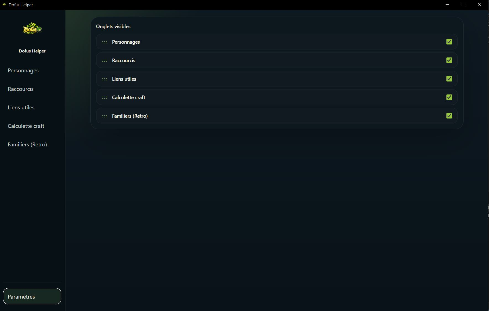

<div align="center">

# 🐉 Dofus Helper

**Un assistant Windows pour gérer plus vite vos fenêtres Dofus, vos raccourcis et vos ressources utiles.**


</div>

---

## ✨ Présentation

**Dofus Helper** est un outil conçu pour simplifier la gestion de plusieurs fenêtres Dofus et centraliser les actions utiles au quotidien.

Il permet notamment de :

- gérer vos personnages Dofus Retro et Dofus Unity ;
- passer rapidement d’une fenêtre à l’autre avec des raccourcis clavier ;
- garder vos liens Dofus importants au même endroit ;
- organiser les onglets visibles dans l’application ;
- automatiser certaines actions de confort liées au focus des fenêtres, sans modifier les fichiers du jeu.

> Dofus Helper est un outil fan-made. Il n’est pas affilié à Ankama et ne remplace pas les règles officielles d’utilisation du jeu.

---

## 📸 Aperçu de l'application

### Gestion des personnages

Ajoutez vos personnages, associez-les à Dofus Retro ou Dofus Unity, puis utilisez les boutons rapides pour gérer le focus, l’ordre de rotation et les actions utiles.



### Raccourcis clavier

Configurez vos touches pour passer à la fenêtre suivante, revenir à la précédente, restaurer le dernier focus ou relancer la détection des fenêtres.



### Liens utiles

Organisez vos sites Dofus favoris par dossiers : bases de données, équipements, outils communautaires, encyclopédies et ressources pratiques.



### Paramètres

Choisissez les onglets visibles dans la barre latérale afin de garder une interface adaptée à votre utilisation.



---

## 🚀 Fonctionnalités principales

| Fonctionnalité | Description |
|---|---|
| **Gestion des personnages** | Ajout, suppression et organisation des personnages Dofus Retro et Unity. |
| **Rotation de fenêtres** | Passage rapide à la fenêtre suivante ou précédente via raccourcis. |
| **Dernier focus** | Retour immédiat à la dernière fenêtre Dofus active. |
| **Détection des fenêtres** | Rafraîchissement manuel des fenêtres Dofus détectées. |
| **Liens utiles** | Dossiers personnalisés pour regrouper vos ressources Dofus. |
| **Interface configurable** | Onglets activables ou masquables depuis les paramètres. |
| **Journal de notifications** | Consultation des événements et informations utiles de l’application. |

---

## 🎮 Cas d’utilisation

### Monocompte

Dofus Helper peut servir à garder le contrôle sur une fenêtre Dofus tout en utilisant d’autres applications à côté.

### Multicompte

L’application est particulièrement utile pour :

- naviguer rapidement entre plusieurs personnages ;
- gérer les échanges entre comptes ;
- organiser l’ordre de rotation ;
- éviter de réorganiser manuellement les fenêtres ;
- relancer rapidement la détection des fenêtres après une reconnexion ou un changement de session.

### Accessibilité

Les raccourcis et la centralisation des actions peuvent aussi aider les joueurs ayant besoin de réduire les manipulations répétitives.

---

## 📦 Installation

1. Téléchargez la dernière version depuis la section **Releases** du dépôt GitHub.
2. Récupérez le fichier `.exe`.
3. Lancez l’application.
4. Ajoutez vos personnages dans l’onglet **Personnages**.
5. Configurez vos raccourcis dans l’onglet **Raccourcis**.
6. Activez ou masquez les modules souhaités depuis **Paramètres**.

---

## 🛠️ Configuration recommandée

### Personnages

Ajoutez chaque personnage avec son nom exact, puis sélectionnez le type de client utilisé : **Retro** ou **Unity**.

### Raccourcis

Définissez des raccourcis simples pour les actions les plus fréquentes :

- fenêtre suivante ;
- fenêtre précédente ;
- dernier focus ;
- actualiser les fenêtres.

### Liens utiles

Créez vos dossiers par thème, par exemple :

- Dofus Unity ;
- Dofus Retro ;
- équipements ;
- quêtes ;
- familiers ;
- outils de craft.

---

## ❓ FAQ

### En quel langage est développé Dofus Helper ?

Dofus Helper est développé en Python.

### Windows affiche un avertissement au lancement. Est-ce normal ?

Oui. Comme l’application peut utiliser des raccourcis clavier et interagir avec les fenêtres ouvertes, Windows peut afficher un avertissement de sécurité, surtout si l’exécutable n’est pas signé numériquement.

### L’application modifie-t-elle les fichiers du jeu ?

Non. Dofus Helper est pensé comme un outil de confort externe : il ne doit pas modifier les fichiers du jeu, le client Dofus ou les paquets réseau.

### Les raccourcis ne fonctionnent pas. Que faire ?

Vérifiez que :

- l’application est bien lancée ;
- vos raccourcis sont enregistrés ;
- aucune autre application n’utilise déjà la même combinaison ;
- les fenêtres Dofus ont été détectées après avoir cliqué sur **Actualiser les fenêtres**.

### Puis-je personnaliser les onglets visibles ?

Oui. L’onglet **Paramètres** permet d’activer ou de masquer les modules visibles dans la barre latérale.

---

## ⚖️ Note concernant les outils fan-made

Dofus Helper est un outil communautaire non officiel. Son objectif est de faciliter l’organisation des fenêtres et des ressources utiles sans intervenir directement dans le jeu.

L’utilisation d’outils tiers reste sous la responsabilité de l’utilisateur. Vérifiez toujours les règles officielles d’Ankama avant d’utiliser un logiciel externe.

---

## 💡 Améliorations et retours

Les retours sont les bienvenus, notamment pour :

- corriger un bug ;
- améliorer l’ergonomie ;
- ajouter une fonctionnalité utile ;
- rendre l’interface plus claire ;
- optimiser la détection des fenêtres.

Ouvrez une **issue GitHub** pour signaler un problème ou proposer une amélioration.

---

## 📁 Structure conseillée pour GitHub

Pour que les images s’affichent correctement dans ce README, placez les fichiers suivants à la racine du dépôt :

```text
README.md
personnages.png
raccourcis.png
liens_utiles.png
parametres.png.jpg
```

Vous pouvez aussi les déplacer dans un dossier `assets/`, mais il faudra alors modifier les chemins dans le README, par exemple :

```markdown

```

---

<div align="center">

**Dofus Helper — un compagnon pratique pour vos sessions Dofus Retro et Unity.**

</div>
